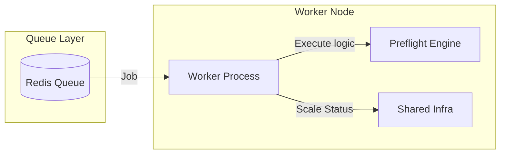

# PrintPrice OS — Preflight Worker (`ppos-preflight-worker`)

## 1. Repository Role
The `ppos-preflight-worker` is the **Asynchronous Execution Node** of the PrintPrice OS. It processes heavy analysis and autofix jobs that are offloaded from the synchronous API to the background queue.

## 2. Architecture Position
It consumes jobs from the OS queue (Redis) and utilizes the `preflight-engine` to perform the actual industrial work.



## 3. Responsibilities
- **Job Consumption**: Polling and processing tasks from the federated queue.
- **Async Processing**: Running long-running PDF corrections (Autofix) without blocking the user API.
- **Status Reporting**: Updating the Control Plane and the original requester on job progress and final success/failure.
- **Failover Handling**: Retrying failed jobs based on the Resilience Policies defined in Shared Infra.

## 4. Key Components
- **`processors/`**: Job handlers (Analyze, Autofix, Maintenance).
- **`queue/`**: BullMQ job consumption and management logic.
- **`resilience/`**: Worker-specific retry and circuit breaker integration.

## 5. Dependency Relationships
- **Internal**: Consumes `ppos-preflight-engine` for core logic.
- **Foundation**: Consumes `ppos-shared-infra` for queue connectivity and state reporting.
- **Control Plane**: Reports operational metrics and job events to the Control Plane.

## 6. Local Development

### Installation
```bash
npm install
```

### Running Locally
```bash
# Start the worker process
npm start
```
Ensure a Redis instance is running and accessible.

## 7. Environment Variables
| Variable | Description | Default |
| :--- | :--- | :--- |
| `REDIS_URL` | Connection string for BullMQ | `redis://127.0.0.1:6379` |
| `MAX_CONCURRENT_JOBS` | Number of simultaneous jobs per worker node | `5` |
| `PPOS_ENVIRONMENT` | Environment (dev/staging/prod) | `development` |

## 8. Version Baseline
**Current Version**: `v1.9.0` (Federated Health & Decoupling Pass)

---
© 2026 PrintPrice. Distributed Execution Infrastructure.